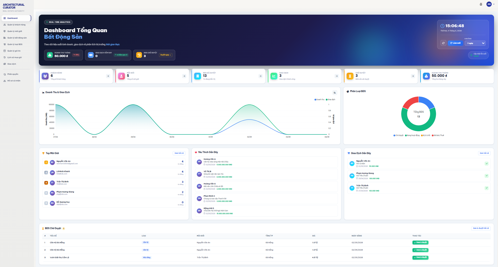
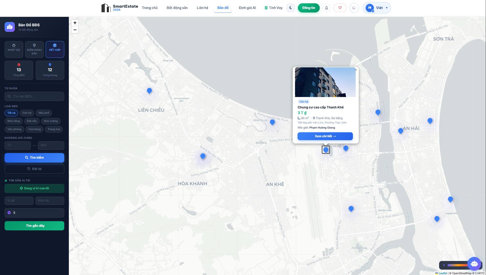
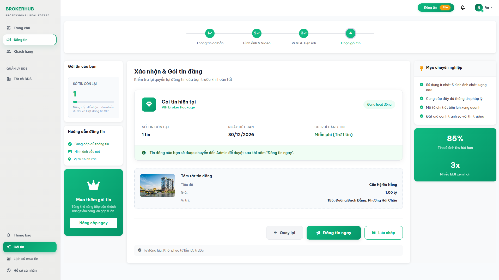
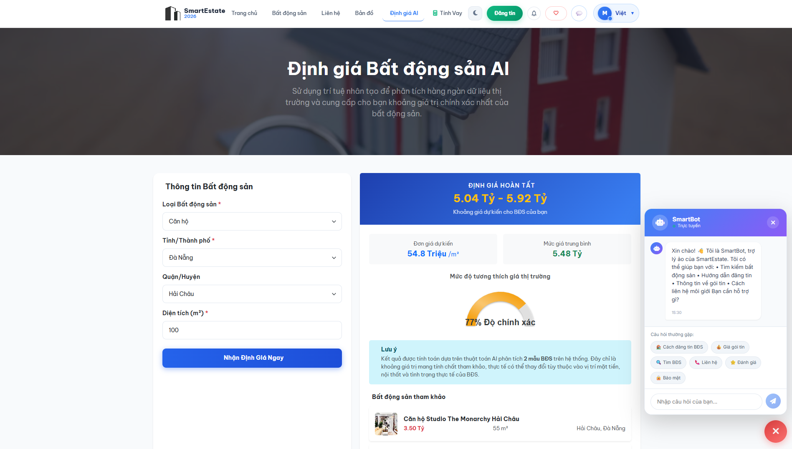

# Hệ Thống Quản Lý Bất Động Sản Tích Hợp AI Định Giá Thông Minh
<div align="center">

[](https://laravel.com)
[](https://vuejs.org)
[](https://www.mysql.com)
[]()

**Đồ án tốt nghiệp - Xây dựng hệ thống quản lý BĐS tích hợp AI định giá thông minh**

[📖 Tài Liệu](#-tài-liệu) | [🚀 Cài Đặt](#-cài-đặt) | [✨ Tính Năng](#-tính-năng) | [👥 Nhóm Phát Triển](#-nhóm-phát-triển)

</div>

---

## 📌 Thông tin dự án

| Danh mục | Chi tiết |
|----------|----------|
| 🌐 Website | *[Đang cập nhật]* |
| 🚀 Phiên bản | v1.0.0 |
| 🛠️ Trạng thái | ✅ Completed |

---

## 📖 Tổng quan

**Hệ Thống Quản Lý Bất Động Sản Tích Hợp AI Định Giá Thông Minh** là giải pháp công nghệ giúp kết nối **Khách hàng – Môi giới – Admin** trên một nền tảng web duy nhất. Hệ thống tập trung vào:

- ✅ Quản lý tin đăng bất động sản chuyên nghiệp
- ✅ Tìm kiếm và hiển thị bất động sản trên bản đồ tương tác
- ✅ **AI định giá thông minh** hỗ trợ ra quyết định nhanh chóng
- ✅ Chatbot tư vấn tự động
- ✅ Thông báo thời gian thực (Real-time Notifications)
- ✅ Phân quyền đa vai trò: Khách hàng / Môi giới / Admin

> ⚠️ **Lưu ý**: Hệ thống tập trung vào **quản lý, tư vấn và định giá**, không phải sàn giao dịch mua bán trực tuyến hoàn chỉnh.

---

## 🖼️ Giao diện hệ thống
### 💻 Dashboard Admin
> *Quản lý người dùng, duyệt tin, thống kê hệ thống*


### 🌐 Giao diện Khách hàng
> *Tìm kiếm, xem chi tiết, bản đồ, yêu thích*


### 🏢 Giao diện Môi giới
> *Đăng tin, quản lý bài đăng, theo dõi tương tác*


### 🤖 AI Định giá & Chatbot
> *Gợi ý giá bất động sản và hỗ trợ tư vấn tự động*


---

## 🗂️ Cấu trúc dự án

```text
KLTN_25/
├── Backend/                     # Laravel backend (API, WebSocket)
├── Frontend/                     # Vue frontend (web)
```

---

## 🛠️ Công nghệ sử dụng

| Thành phần | Công nghệ |
|-----------|-----------|
| **Frontend** | Vue 3, Vite, Vue Router, TailwindCSS, Bootstrap, Axios |
| **Bản đồ & Định vị** | Leaflet.js, Turf.js |
| **Real-time** | Laravel Reverb, Laravel Echo, Pusher.js |
| **Backend** | Laravel 12, PHP 8.2, Laravel Sanctum |
| **Cơ sở dữ liệu** | MySQL, XAMPP |
| **AI & Chatbot** | Tích hợp API định giá và chatbot |
| **Thanh toán** | SePay (mua gói tin) |
| **Xuất báo cáo** | Laravel DomPDF, PhpSpreadsheet |

---

## ✨ Tính năng nổi bật

### Khách hàng
- Đăng ký, đăng nhập, quên mật khẩu
- Tìm kiếm và lọc bất động sản
- Xem chi tiết tin đăng
- Xem trên bản đồ và tìm vị trí gần nhất
- Yêu thích / bỏ yêu thích bài đăng
- Chatbot tư vấn
- AI định giá bất động sản
- Đặt lịch xem nhà

### Môi giới
- Đăng tin bất động sản
- Quản lý bài đăng và hình ảnh
- Mua gói tin
- Theo dõi lượt quan tâm và thông báo realtime
- Quản lý lịch hẹn và khách hàng

### Admin
- Quản lý khách hàng, môi giới, tin đăng
- Duyệt / từ chối bài viết
- Quản lý loại bất động sản, khu vực
- Quản lý gói tin và giao dịch
- Phân quyền người dùng
- Xem thống kê và biểu đồ hệ thống

---

## 🚀 Cài đặt nhanh

### 🔧 Yêu cầu hệ thống
- PHP ≥ 8.2
- Composer
- Node.js ≥ 18
- MySQL ≥ 8.0
- XAMPP (khuyến nghị)

### 1) Cài đặt Backend

```bash
cd BE
composer install
cp .env.example .env
php artisan key:generate
php artisan migrate --seed
php artisan serve
php artisan reverb:start
```

### 2) Cài đặt Frontend

```bash
cd FE
npm install
cp .env.example .env
npm run dev
```

---

## 🔐 Bảo mật & Phân quyền

- **Laravel Sanctum**: xác thực theo token và theo role
- **Private WebSocket Channels**: bảo mật thông báo realtime
- **Mã hóa mật khẩu**: bcrypt
- **Bảo vệ CSRF** và các cơ chế chống tấn công phổ biến của Laravel

---

## 📞 Liên hệ & đóng góp

Mọi thắc mắc, báo lỗi hoặc đề xuất tính năng, vui lòng:

- Tạo Issue mới trên repository
- Hoặc liên hệ trực tiếp team phát triển

**Email liên hệ:** [admin@bds.com]  
**Repository:** [https://github.com/KLTN-03-2026/GR25]

---

